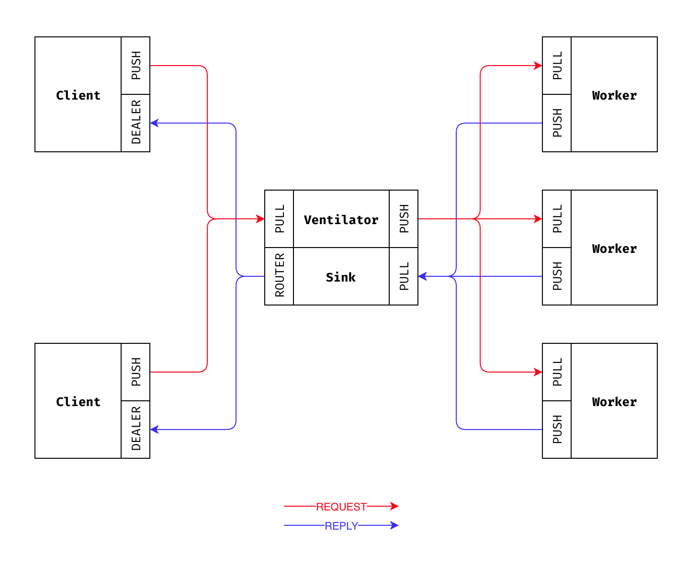

# Ventilator

```sh
RUST_LOG=info cargo run --example client
RUST_LOG=info cargo run --example broker
RUST_LOG=info cargo run --example worker
```

You can spawn multiple clients/workers using provided shells:
```sh
RUST_LOG=info ./clients 2
RUST_LOG=info ./workers 2
```

---

